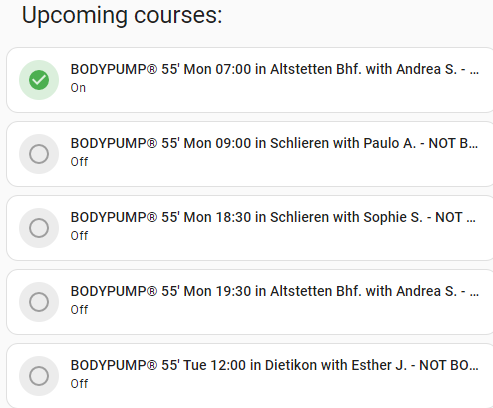

[](https://github.com/hacs/integration)


# Activ Fitness Integration for Home Assistant

Note: You need to have an active membership to use this component.

This component lets you see the when your favorite courses in your favorite fitness locations are scheduled. You can also book these courses.

It provides also information about your studio check-ins.

## Features


### Senors

### Front End:



Using Home Assitant's `tile` card you can have a very compact UI for displaying the upcoming courses. By clicking on the circles, you can book / unbook a course. Please give it a couple of seconds to execute the booking and update the UI.

``` YAML
type: vertical-stack
title: 'Upcoming courses:'
cards:
  - type: tile
    entity: binary_sensor.activ_fitness_course_0_booked
    icon_tap_action:
      action: call-service
      service: activ_fitness.toggle_booking
      data: {}
      target:
        entity_id: binary_sensor.activ_fitness_course_0_booked
    color: green
  - type: tile
    entity: binary_sensor.activ_fitness_course_1_booked
    icon_tap_action:
      action: call-service
      service: activ_fitness.toggle_booking
      data: {}
      target:
        entity_id: binary_sensor.activ_fitness_course_1_booked
    color: green
  - type: tile
    entity: binary_sensor.activ_fitness_course_2_booked
    icon_tap_action:
      action: call-service
      service: activ_fitness.toggle_booking
      data: {}
      target:
        entity_id: binary_sensor.activ_fitness_course_2_booked
    color: green
  - type: tile
    entity: binary_sensor.activ_fitness_course_3_booked
    icon_tap_action:
      action: call-service
      service: activ_fitness.toggle_booking
      data: {}
      target:
        entity_id: binary_sensor.activ_fitness_course_3_booked
    color: green
  - type: tile
    entity: binary_sensor.activ_fitness_course_4_booked
    icon_tap_action:
      action: call-service
      service: activ_fitness.toggle_booking
      data: {}
      target:
        entity_id: binary_sensor.activ_fitness_course_4_booked
    color: green


```

## Usage

Lovelace example: TODO


## Installation
### Option 1 (Recommended)

Use HACS. This ensures, you receive notifications about newer versions.

### Option 2

1. Using the tool of choice open the directory (folder) for your HA configuration (where you find `configuration.yaml`).
2. If you do not have a `custom_components` directory (folder) there, you need to create it.
3. In the `custom_components` directory (folder) create a new folder called `integration_blueprint`.
4. Download _all_ the files from the `custom_components/integration_blueprint/` directory (folder) in this repository.
5. Place the files you downloaded in the new directory (folder) you created.
6. Restart Home Assistant
7. In the HA UI go to "Configuration" -> "Integrations" click "+" and search for "Integration blueprint"

Using your HA configuration directory (folder) as a starting point you should now also something similar to this (Note: _Not all actual files are listed here_):

```text
custom_components/activ_fitness/translations/en.json
custom_components/activ_fitness/__init__.py
custom_components/activ_fitness/api.py
custom_components/activ_fitness/binary_sensor.py
custom_components/activ_fitness/button.py
custom_components/activ_fitness/config_flow.py
custom_components/activ_fitness/const.py
custom_components/activ_fitness/manifest.json
custom_components/activ_fitness/sensor.py
```

## Configuration is done in the UI

You need to enter the IP address of your V-Zug appliance. Typically, you would log into your router and look under connected devices. Once you found it, make sure you assign it as a static IP address. Otherwise, it might change at some point and break the link to the integration.


<!---->

## Contributions are welcome!

If you want to contribute to this please read the [Contribution guidelines](CONTRIBUTING.md)

![license-shield]

***

[integration_blueprint]: https://github.com/custom-components/integration_blueprint
[buymecoffee]: https://www.buymeacoffee.com/ludeeus
[buymecoffeebadge]: https://img.shields.io/badge/buy%20me%20a%20coffee-donate-yellow.svg?style=for-the-badge
[commits-shield]: https://img.shields.io/github/commit-activity/y/custom-components/blueprint.svg?style=for-the-badge
[commits]: https://github.com/magicmatt007/v_zug/commits/master
[hacs]: https://github.com/custom-components/hacs
[hacsbadge]: https://img.shields.io/badge/HACS-Custom-orange.svg?style=for-the-badge
[discord]: https://discord.gg/Qa5fW2R
[discord-shield]: https://img.shields.io/discord/330944238910963714.svg?style=for-the-badge
[exampleimg]: example.png
[forum-shield]: https://img.shields.io/badge/community-forum-brightgreen.svg?style=for-the-badge
[forum]: https://community.home-assistant.io/
[license-shield]: https://img.shields.io/github/license/custom-components/blueprint.svg?style=for-the-badge
[maintenance-shield]: https://img.shields.io/badge/maintainer-Joakim%20Sørensen%20%40ludeeus-blue.svg?style=for-the-badge
[releases-shield]: https://img.shields.io/github/release/custom-components/blueprint.svg?style=for-the-badge
[releases]: https://github.com/custom-components/integration_blueprint/releases
